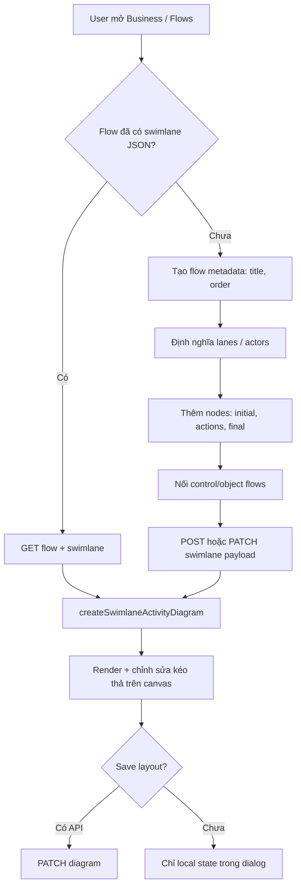

# Swimlane diagram — luồng nhập, JSON và API

Tài liệu mô tả dữ liệu và API cần để hiển thị **UML Activity Swimlane** trên React Flow (`components/ui/swimlane-react-flow.tsx`), dùng tại màn **Business → Flows** (`app/(org)/[slug]/projects/[projectSlug]/business/flow`).

## Trạng thái hiện tại

| Thành phần | Trạng thái |
|-----------|-----------|
| Danh sách flow (card + form) | API thật: `GET/POST/PATCH/DELETE /api/v1/projects/{project_id}/flows` |
| Swimlane diagram (link «Xem chi tiết swimlane» trên card flow đã có actions) | **API:** `GET flow` (`useProjectFlow`) + `PUT …/swimlane` (`useUpdateProjectFlowSwimlane`); **FE:** `flowSwimlaneBridge` → `createSwimlaneActivityDiagram()` trong `flowSwimlaneDialog.tsx` |
| Lưu layout swimlane (vị trí node, edge, label, waypoints) | `useUpdateProjectFlowSwimlane` → `fetchFlow.putSwimlane` (merge: `applyReactFlowLayoutToProjectFlowSwimlane` — node `x`/`y`/lane + edge handles, `guard`, `label_offset`, **`waypoints`**) — contract BE: [`swimlane-edge-routing-api.md`](./swimlane-edge-routing-api.md) |

Flow list hiện lưu `title`, `description` (chuỗi bước), `order`. Swimlane cần thêm cấu trúc **lanes, nodes, edges** và tùy chọn **layout** (tọa độ).

---

## Luồng nhập (end-to-end)



### Bước nghiệp vụ gợi ý

1. **Tạo flow** — `title`, `order` (và mô tả tóm tắt nếu cần cho list).
2. **Khai báo swimlanes (partitions)** — danh sách lane: `id` + `title` (ví dụ Student, System, Training Staff).
3. **Khai báo nodes** — mỗi node gắn một `laneId`, có `notation` và `label`; **`y`** bắt buộc; **`x`** (tọa độ ngang tuyệt đối trong pool) tùy chọn — khi BE gửi `x` trên `actions` / `initial_node` / `activity_final_node`, FE dùng trực tiếp và **bỏ qua** offset ngang trong `layout.swimlaneNodeOffsetX` cho node đó. `width` / `height` trên action có thể có trên wire để round-trip; kích thước hiển thị node vẫn theo notation + `layout` mặc định trừ khi sau này map sang style node.
4. **Khai báo flows (edges)** — `source` / `target` node id, nhãn trên dây, loại `control` | `object`, handle nối (tùy chọn).
5. **Initial / Activity final** — một node `initial`, một node `activityFinal` (thường cùng lane bắt đầu/kết thúc).
6. **Mở diagram** — FE gọi `createSwimlaneActivityDiagram(config)` → React Flow.
7. **Lưu** — gửi payload swimlane lên backend (đề xuất bên dưới).

---

## JSON FE cần (`SwimlaneActivityDiagramConfig`)

Đây là contract TypeScript hiện dùng trong `createSwimlaneActivityDiagram()`. Backend nên trả về (hoặc nhận) cùng shape này (camelCase trong app; snake_case trên wire nếu theo convention API khác).

### Schema tổng quan

```json
{
  "id": "course-registration-swimlane",
  "title": "Activity: Đăng ký khóa học",
  "lanes": [
    { "id": "student", "title": "Student" },
    { "id": "system", "title": "System" },
    { "id": "training-staff", "title": "Training Staff" }
  ],
  "initialNode": {
    "id": "event-start",
    "laneId": "student",
    "y": 128
  },
  "activityFinalNode": {
    "id": "event-end",
    "laneId": "student",
    "y": 1380
  },
  "layout": {
    "laneWidth": 520,
    "poolHeight": 0,
    "poolBottomPadding": 140
  },
  "actions": [],
  "flows": []
}
```

| Field | Bắt buộc | Mô tả |
|-------|----------|--------|
| `id` | Có | Id diagram (thường trùng `flow_id` hoặc suffix `-swimlane`) |
| `title` | Có | Tiêu đề Activity / pool (header khung swimlane) |
| `lanes` | Có (≥1) | Cột swimlane / partition |
| `initialNode` | Có | Initial node (UML) |
| `activityFinalNode` | Có | Activity final node (UML) |
| `actions` | Có | Danh sách node: action, objectNode, decision, merge, fork, join |
| `flows` | Có | Cạnh nối giữa các node |
| `layout` | Không | Ghi đè kích thước pool/lane; `poolHeight: 0` = auto theo node thấp nhất. FE còn lưu `swimlaneNodeOffsetX`: object `nodeId → number` (delta X so với tâm lane) khi user kéo ngang trong lane. |

**`layout.swimlaneNodeOffsetX` (tuỳ chọn, FE):** map `{ "<node-id>": <pixels> }` — offset so với vị trí X căn giữa lane; PUT swimlane kèm trong `layout` để F5 giữ vị trí ngang.

### `lanes[]`

```json
{ "id": "student", "title": "Student" }
```

- `id`: stable, dùng trong `laneId` của mọi node thuộc lane đó.
- `title`: nhãn hiển thị trên header cột.

### `actions[]` (nodes)

```json
{
  "id": "select-course",
  "laneId": "student",
  "index": 1,
  "label": "Chọn khóa học",
  "notation": "action",
  "y": 210
}
```

| Field | Bắt buộc | Giá trị |
|-------|----------|---------|
| `id` | Có | Unique trong diagram |
| `laneId` | Có | Khớp `lanes[].id` |
| `label` | Có* | Text trên node (*`fork` / `join` không hiển thị label trên canvas; có thể `""`) |
| `notation` | Không (mặc định `action`) | `action` \| `objectNode` \| `decision` \| `merge` \| `fork` \| `join` |
| `index` | Không | Số thứ tự hiển thị (Action 1, 2, …) — chỉ với `action` |
| `y` | Có* | Tọa độ Y trong pool (*FE có thể auto nếu thiếu, nhưng nên lưu sau khi user kéo) |

**Lưu ý:** `initialNode` và `activityFinalNode` **không** nằm trong `actions[]`; chúng là field riêng với `notation` implicit (`initial` / `activityFinal`).

### `flows[]` (edges)

**Wire (PUT) / GET:** `source_handle` / `target_handle` là enum ngắn `top` \| `bottom` \| `left` \| `right` (BE 422 nếu khác). FE map ↔ id handle React Flow (`right` ↔ `right-source` / `right-target` tùy vai trò).

```json
{
  "id": "f-start-a0",
  "source": "start",
  "target": "<action-uuid>",
  "source_handle": "bottom",
  "target_handle": "top",
  "guard": "Có trong danh sách",
  "flow_type": "control",
  "label_offset": { "x": 0, "y": 0 }
}
```

| Field | Bắt buộc | Mô tả |
|-------|----------|--------|
| `source` / `target` | Có | `id` node nguồn/đích |
| `source_handle` / `target_handle` | Không | Enum BE; trong app diagram → id handle RF đầy đủ |
| `guard` | Không | Text điều kiện nhánh trên dây (vd. reject branch) |
| `label` | Không | Tên edge override (hiếm); hiển thị ưu tiên `label` rồi `guard` |
| `flowType` | Không | `control` (mặc định) \| `object` |
| `labelOffset` | Không | Offset thêm sau khi user kéo nhãn (`{ x, y }`) |
| `waypoints` | Không | Mọi đỉnh gấc đã chỉnh (pool px); bỏ trống = auto-route nhưng FE vẫn hiện handle kéo tại mọi góc suy ra. Chi tiết: [`swimlane-edge-routing-api.md`](./swimlane-edge-routing-api.md) |

#### Handle ids (React Flow trên node)

```
top-target | top-source
...
```

**Rút gọn BE:** `right` → `right-source` (nguồn) hoặc `right-target` (đích) trong `projectFlowSwimlaneToDiagramConfig`. PUT: `swimlaneRfHandleIdToWireEnum` gửi lại enum ngắn.

**FE (`flowSwimlaneBridge.ts`):** Khi payload không kèm handle, suy luận handle theo lane và `y` (ngoại lệ `fork` / `join`).

**Fork / Join** (thanh đồng bộ UML, không có chữ trên node):

| Node | Handle |
|------|--------|
| `fork` | `top-target` (vào); `bottom-left-source`, `bottom-right-source` (ra song song, tối thiểu 2 nhánh) |
| `join` | `top-left-target`, `top-right-target` (vào); `bottom-source` (ra) |

Ví dụ mock (sau merge): `merge-ready` → `fork-parallel` → hai action song song → `join-parallel` → action tiếp theo.

### Routing cạnh (FE)

Edge type `swimlaneEditable` dùng `getSwimlaneEdgePath()`:

| Trường hợp | Hành vi |
|------------|---------|
| Cùng cột (\|Δx\| ≤ 6px) | **Một đoạn thẳng dọc** |
| Cùng hàng (\|Δy\| ≤ 6px) | **Một đoạn thẳng ngang** |
| Lệch trục (vd. bottom → top khác lane) | Gấp khúc **vuông góc**, tối đa một đoạn ngang ở giữa — **không** bo cong, **không** offset step thừa |

Khuyến nghị khi authoring JSON: node cùng lane nên dùng `bottom-source` → `top-target` để căn giữa lane (FE tự căn `x` theo `laneWidth` + `nodeWidth`).

### `layout` (tùy chọn)

```json
{
  "laneWidth": 520,
  "poolHeight": 0,
  "poolHeaderHeight": 36,
  "laneHeaderHeight": 36,
  "poolBottomPadding": 120,
  "actionWidth": 280,
  "actionHeight": 88,
  "syncBarWidth": 128,
  "syncBarHeight": 12
}
```

Default FE (`swimlaneActivityLayout`): `laneWidth: 520`, `poolBottomPadding: 120`, …

- `poolHeight: 0` hoặc bỏ field → FE tính chiều cao pool = max(bottom của nodes) + `poolBottomPadding`.
- Mock hiện tại: `laneWidth: 520`, `poolBottomPadding: 140`.
- Sau khi user resize pool / kéo node, nên **persist** `layout` + tọa độ `x,y` từng node (mở rộng schema sau).

### Ví dụ đầy đủ (rút gọn)

Xem ví dụ cấu hình trong `components/ui/swimlane-react-flow.tsx` (`createSwimlaneActivityDiagram`) hoặc payload mẫu trong tài liệu này / contract OpenAPI backend.

---

## Mapping với API Flow (list / form / swimlane)

Service: `lib/api/services/fetchFlow.ts` · hooks: `hooks/useFlow.ts`

| API | Method | Body / ghi chú |
|-----|--------|----------------|
| List | `GET /api/v1/projects/{project_id}/flows` | `ProjectFlow[]` (có thể không gồm `swimlane` đầy đủ) |
| Detail | `GET /api/v1/projects/{project_id}/flows/{flow_id}` | Một `ProjectFlow` + `swimlane` khi BE trả |
| Create | `POST .../flows` | `{ code, name, description, actions }` |
| Update | `PATCH .../flows/{flow_id}` | `{ code, name, description }` |
| Swimlane | `PUT .../flows/{flow_id}/swimlane` | Payload swimlane snake_case (`toProjectFlowSwimlanePutWire`) |
| Delete | `DELETE .../flows/{flow_id}` | `{ success, message? }` |

**Response row (app, rút gọn):**

```ts
interface ProjectFlow {
  id: string;
  projectId: string;
  code: string;
  name: string;
  description: string; // text bước (parseFlowSteps)
  actions: unknown[];
  order: number;
  title: string;       // tiêu đề activity / swimlane từ BE
  swimlane: ProjectFlowSwimlane | null;
  createdAt: string;
  updatedAt: string;
}
```

`description` vẫn dùng cho **preview list** (`parseFlowSteps`). **Swimlane** đầy đủ lấy từ `swimlane` (GET detail / POST create) hoặc lưu qua `PUT .../swimlane` (`useUpdateProjectFlowSwimlane`).

---

## API đề xuất cho Swimlane (backend)

### Option A — Nhúng vào Flow (đơn giản)

Mở rộng `ProjectFlow` / response row:

```json
{
  "id": "uuid",
  "project_id": "uuid",
  "title": "Đăng ký khóa học",
  "description": "Tóm tắt text (optional)",
  "order": 0,
  "swimlane": { /* SwimlaneActivityDiagramConfig snake_case */ },
  "created_at": "...",
  "updated_at": "..."
}
```

| Endpoint | Mục đích |
|----------|----------|
| `GET .../flows` | List; mỗi item có thể có `swimlane: null` nếu chưa thiết kế diagram |
| `GET .../flows/{flow_id}` | Chi tiết + swimlane đầy đủ |
| `POST .../flows` | Tạo flow; body có thể gồm metadata + `swimlane` optional |
| `PATCH .../flows/{flow_id}` | Cập nhật metadata và/hoặc `swimlane` |
| `PUT .../flows/{flow_id}/swimlane` | **Chỉ** lưu diagram (khuyến nghị khi chỉ save canvas) |
| `DELETE .../flows/{flow_id}` | Xóa flow + swimlane |

**PUT/PATCH swimlane body (snake_case gợi ý):**

```json
{
  "title": "Activity: Đăng ký khóa học",
  "lanes": [{ "id": "student", "title": "Student" }],
  "initial_node": { "id": "event-start", "lane_id": "student", "y": 128 },
  "activity_final_node": { "id": "event-end", "lane_id": "student", "y": 1040 },
  "layout": { "lane_width": 520, "pool_height": 0, "pool_bottom_padding": 140 },
  "actions": [
    {
      "id": "select-course",
      "lane_id": "student",
      "index": 1,
      "label": "Chọn khóa học",
      "notation": "action",
      "y": 210
    }
  ],
  "flows": [
    {
      "id": "start-to-select-course",
      "source": "event-start",
      "target": "select-course",
      "source_handle": "bottom-source",
      "target_handle": "top-target",
      "label": "[start registration]",
      "flow_type": "control",
      "label_offset": { "x": 0, "y": 0 }
    }
  ]
}
```

### Option B — Resource riêng `flow-diagrams`

| Endpoint | Mục đích |
|----------|----------|
| `GET /api/v1/projects/{project_id}/flows/{flow_id}/diagram` | Lấy swimlane |
| `PUT /api/v1/projects/{project_id}/flows/{flow_id}/diagram` | Ghi đè diagram |

Flow metadata vẫn dùng API flows hiện tại.

---

## FE hooks / query keys (khi có API)

| Mục đích | Gợi ý |
|----------|--------|
| List flows | `useProjectFlows` + `projectFlowsQueryKey(projectId)` |
| Chi tiết flow | `useProjectFlow` + `projectFlowQueryKey(projectId, flowId)` |
| Lưu swimlane | `useUpdateProjectFlowSwimlane` → `fetchFlow.putSwimlane` |
| Diagram | (Tuỳ chọn) map `ProjectFlowSwimlane` → `createSwimlaneActivityDiagram` sau khi align schema |
| Sau save diagram | `invalidateQueries` key diagram (+ list nếu đổi title/order) |

---

## Notation UML hỗ trợ trên canvas

| `notation` | Hiển thị | Ghi chú |
|------------|---------|--------|
| *(initial)* | Chấm đen | Field `initialNode` |
| `action` | Hình chữ nhật bo góc xanh | Task |
| `objectNode` | Hình chữ nhật vuông xanh | Object node |
| `decision` | Kim cương | Decision node |
| `merge` | Kim cương | Merge node |
| `fork` | Thanh ngang đen dày (không label) | 1 vào, ≥2 ra song song |
| `join` | Thanh ngang đen dày (không label) | ≥2 vào, 1 ra |
| *(activityFinal)* | Vòng tròn kép | Field `activityFinalNode` |

| `flowType` | Edge |
|------------|------|
| `control` | Control flow (mặc định), nét liền |
| `object` | Object flow (cùng style, phân biệt bằng label / nghiệp vụ) |

---

## Checklist tối thiểu để “có swimlane”

- [ ] Ít nhất 1 flow record (`id`, `title`, `order`)
- [ ] `lanes.length >= 1`
- [ ] `initialNode` + `activityFinalNode` với `laneId` hợp lệ
- [ ] Mỗi `actions[].laneId` ∈ `lanes[].id`
- [ ] Mỗi `flows[].source` / `target` trỏ tới `initialNode.id`, `activityFinalNode.id`, hoặc `actions[].id`
- [ ] Graph liên thông từ initial → … → final (khuyến nghị)
- [ ] (Tuỳ chọn) `y` và `layout` để giữ layout sau khi chỉnh sửa
- [ ] `fork` / `join`: đủ handle và flows (fork: 1 vào + ≥2 ra; join: ≥2 vào + 1 ra)

---

## File liên quan trong repo

| File | Vai trò |
|------|---------|
| `components/ui/swimlane-react-flow.tsx` | Types, `createSwimlaneActivityDiagram`, `getSwimlaneEdgePath`, node/edge types |
| `app/.../business/flow/components/flowList.tsx` | Danh sách flow + form (mã, tên, bước) |
| `lib/api/services/fetchFlow.ts` | CRUD flow metadata |
| `app/.../business/flow/components/flowSteps.ts` | Parse/serialize `description` dạng chuỗi bước |

---

## Ghi chú triển khai

1. **Phase 1:** Backend trả `swimlane` JSON theo schema trên; FE thay mock bằng `GET flow` + map snake_case → camelCase.
2. **Phase 2:** `PUT diagram` khi đóng dialog hoặc nút Save; persist `position` (`x`, `y`) cho mọi node sau drag (mở rộng `actions` / events).
3. **Phase 3:** Editor UI (form thêm lane, node, edge) thay vì chỉ sửa JSON / kéo trên canvas.
